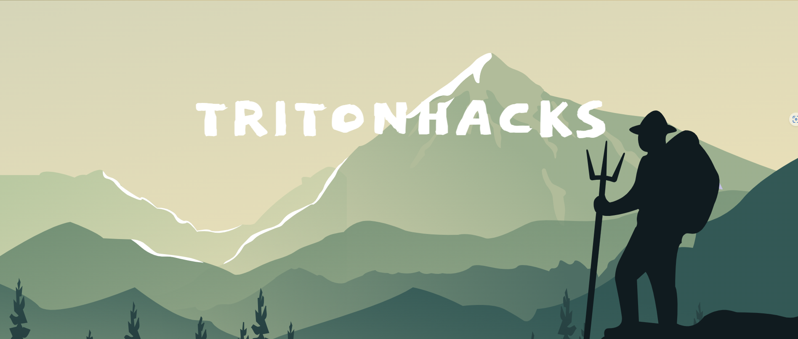

# TritonHacks Web Development   Starter Kit
Welcome to Triton Hacks - your gateway to coding and tech exploration! This is the starter kit for those who want to learn about web development and how we can create websites!

Get set for an exciting journey through some awesome modules that'll show you everything about the internet, how websites operate, and how they're built. We'll first explain web development, the different areas of it, and then go into the nitty gritty of creating one. 

The first module is thus an explanation of the concepts on a high level, the second module are the tutorials, and the third module is where we show you how to create an example website. If you're already confident, feel free to dive into the modules you're most interested in. 

If you ever feel lost, just use the search bar to quickly find what you're looking for—it'll guide you straight there! Get ready for an incredible learning adventure—it's going to be awesome! 🚀✨

{: .note}
We highly recommend using the dark theme at the top right corner for better contrast.

[Next: Web Development Concepts](Web Development Concepts){: .float-right .v-align-text-top}

