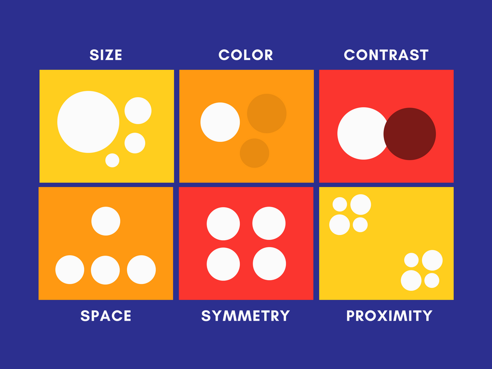

# User Interaction
{: .no_toc }

## Table of contents
{: .no_toc .text-delta }

1. TOC
{:toc}

---

{: .note }
> By [Kevin Shin](https://www.linkedin.com/in/kevin-shin-373183188/)

With DEI in mind, let's explore some principles that can help us be more inclusive.
### User Interaction Principes
#### 🔍 **Adjustable Text Size and Font**
Ensuring content is readable for all, including those with visual impairments, is key to digital accessibility. Adjustable text sizes and fonts allow users to tailor their reading experiences for visual comfort, making digital spaces welcoming to everyone.

#### 🎨 **Use of Colors and Sounds**
Proper color contrast and sound cues significantly improve usability for users with vision or hearing differences. This ensures that information is accessible and interaction is seamless for everyone.

#### 🖼 **Alternative Text for Images**
Alternative text for images is vital for users relying on screen readers, allowing them to comprehend visual content they cannot see, thereby making websites and apps more inclusive.

#### 🎙 **Accessible Controls**
Voice commands and customizable controls ensure that technology is accessible to individuals with diverse physical abilities, offering ways to interact with devices that suit their needs.

#### ⌨️ **Keyboard Navigation**
Keyboard-only navigation is crucial for individuals who cannot use a mouse, making digital content navigable and inclusive for users with motor impairments.

#### 📝 **Closed Captioning and Transcripts**
Closed captions and transcripts ensure that deaf or hard of hearing users have access to audio and video content, supporting equality in information access.

#### ❗ **Error Identification and Suggestions**
Providing intuitive feedback on errors helps users correct mistakes easily, improving the user experience and ensuring successful interactions with digital platforms.

#### 👥 **Testing with Real Users**
User testing with a diverse group provides insights into accessibility and usability challenges, leading to digital products that are genuinely inclusive.

These are the most basic of them all. If you want to explore, you can learn more at [apple's guideline](https://developer.apple.com/design/human-interface-guidelines).

[Previous: Design](../Design){: .float-left .v-align-text-top}
[Next: User Experience](User Experience){: .float-right .v-align-text-top}